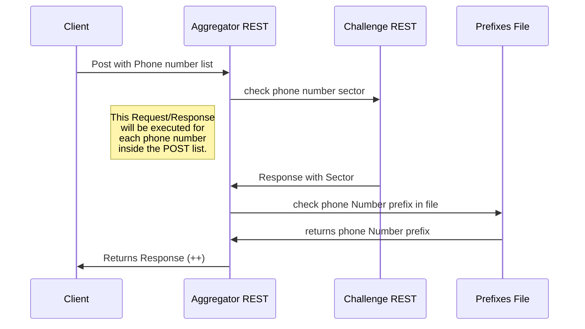

# Welcome to Phone Number Aggregator!

Hello! My name is **Francisco Filipe**. This file has the necessary documentation to run the **Talk Desk Exercise**. Hope you enjoy!

# Files

The main files on this exercise are the Spring Boot Jar **exercise-1.0.jar** and the file **prefixes.txt** provided by talk desk.
You must have the **prefixes.txt** on the same folder of the jar, unless you change it's path in the **application.properties** file
This application does not run **offline!**

# How the application works?

You have a rest endpoint in http://localhost:8080/aggregate.
This endpoint will receive a **POST** request with a list of phone number as Strings. There is no limit of phone numbers that you can put on this list.

> **Phone Number List Example:**
["+1983236248", "+1 7490276403", "001382355A", "+351917382672", "+35191734022"]

The application will then perform several operations in each phone numbers.
You can add any type of special character to the numbers, i.e. (%#/(&%@§£€..) or even letters. The application will remove the invalid characters of the phone numbers. 
Then, it will take the validated phone numbers and access a rest endpoint to check the sector of each validated phone number.

>**TalkDesk Challenge Endpoint**
>https://challenge-business-sector-api.meza.talkdeskstg.com/sector/{phoneNumber}

Then, if the endpoint provides a **http Status OK (200)**, the application will store the sector and check the prefix of the number in the **prefixes.txt** file.

- Rest Endpoint: REST API
- HTML: publish the file converted to HTML via a Handlebars template (on a blog for example).



>**(++)** This response has a http status and a body. In this body the phone numbers are groupped by prefix and sector.

```json
{
    "1": {
        "Technology": 1,
        "Banking": 1
    },
    "3519173": {
        "Clothing": 2
    }
}
```

# Properties
In **application.properties** file you can set come custom properties:
You can ser the default endpoint for talkdesk **challenge endpoint** and the **sector endpoint**.
You can also define the path of your custom **prefixes.txt** file.
If no property is defined, defaults will be used.
```
challenge.rest.endpoint=https://challenge-business-sector-api.meza.talkdeskstg.com  
challenge.rest.sector=/sector/  
  
file.prefix.name=prefixes.txt
```

# Running the app

Just open your favourite console and run the command:
```
java -jar exercise-1.0.jar
```
You will see a welcome endpoint in http://localhost:8080/